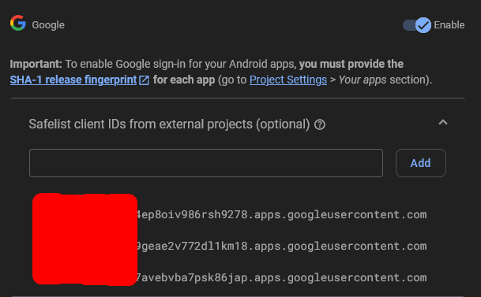

# Easy Setup Keytool flutter

1. The first step goto your terminal on your project type this code in terminal

```powershell
keytool -genkey -v -keystore <your-path-folder-and-name-file>.jks -storetype JKS -keyalg RSA -keysize 2048 -validity 10000 -alias <your-alias-name>

# change the <your-path-folder-and-name-file>.jks like example C:\Users\xxxx\xxxx\androidexamplekey.jks
# and change <your-alias-name> like example androidexamplekey
```

2. You will be asked to enter several questions and a password. ⚠ REMEMBER MAKE SURE SAVE YOUR CREATING PASSWORD BECAUSE ITS IMPORTANT FOR NEXT STEP ⚠

3. Then if your file already complete and show this warning like this
   

4. Just follow the command and paste on your terminal or paste this

```powershell
keytool -importkeystore -srckeystore <your-path-folder-and-name-file>.jks -destkeystore <your-path-folder-and-name-file>.jks -deststoretype pkcs12

# change the <your-path-folder-and-name-file>.jks like example C:\Users\xxxx\xxxx\androidexamplekey.jks
```

5. Now how to get the SHA1 and SHA256 ? paste this code in your terminal and enter, it will be need input password for keytool you already created before.

```powershell
keytool -list -v -alias <your-alias-name-you-create-before> -keystore <your-path-folder-and-name-file>.jks
```

6. It will be generate like this
   

7. Now open your firebase and goto your project setting, make sure you already set on in login with google. scroll down and you will be found like this
   

8. Add your SHA1 and SHA 256 with click button fingerprint and input on there

9. Now we need to download [google-services.json]() and place on yourprojectpath/android/app/google-services.json
   

10. Now add this line in file [settings.gradle]() and [build.gradle]()

```gradle
# add in settings.gradle
plugins {
    id "com.google.gms.google-services" version "4.3.15" apply false
}

# add in build.gradle
plugins {
    id "com.android.application"
    id 'com.google.gms.google-services'
}
```

11. Now create file [key.properties]() in /android/key.properties like this

```properties
storePassword=<password-from-previous-step>
keyPassword=<password-from-previous-step>
keyAlias=<your-alias-from-previous-step>
storeFile=<keystore-file-location>

# The storeFile might be located at /Users/<user name>/upload-keystore.jks on macOS or C:/Users/<user name>/example.jks on Windows.
```

## configure signing in gradle

1. When building your app in release mode, configure gradle to use your upload.key. To configure gradle, edit the "<project>/android/app/build.gradle" file.

```gradle
def keystoreProperties = new Properties()
def keystorePropertiesFile = rootProject.file('key.properties')
if (keystorePropertiesFile.exists()) {
    keystoreProperties.load(new FileInputStream(keystorePropertiesFile))
}

android {
    // ...

   //dont change anything in here
    signingConfigs {
        release {
            keyAlias = keystoreProperties['keyAlias']
            keyPassword = keystoreProperties['keyPassword']
            storeFile = keystoreProperties['storeFile'] ? file(keystoreProperties['storeFile']) : null
            storePassword = keystoreProperties['storePassword']
        }
    }

    buildTypes {
        release {
            // TODO: Add your own signing config for the release build.
            // Signing with the debug keys for now,
            // so `flutter run --release` works.
            signingConfig = signingConfigs.debug
            signingConfig = signingConfigs.release
        }
    }
...
}
```

2. Now back to your terminal and paste

```powershell
cd android
./gradlew signingReport
```

3. It will be show like this

```markdown
> Task :app:signingReport
> Variant: release
> Config: release
> Store: <will-be-show-your-path-where-you-created>
> Alias: <will-be-show-your-alias-before>
> MD5: A5:88:41:04:8D:06:71:6D:FE:33:76:87:AC:AD:19:23
> SHA1: A7:89:E5:05:C8:17:A1:22:EA:90:6E:A6:EA:A3:D4:8B:3A:30:AB:18
> SHA-256: 05:A2:2C:35:EE:F2:51:23:72:4D:72:67:A5:6C:8C:58:22:2A:00:D6:DB:F6:45:D5:C1:82:D2:80:A4:69:A8:FE
> Valid until: Wednesday, August 10, 2044
```

4. Make sure your SHA1 and SHA256 same as your input in project setting on firebase before

5. Type on your terminal or paste this

```bash
flutter clean
flutter pub get
```

Then try the build debug and test your app

# Fix [firebase_auth/invalid-credential]

When you see this error when try login your app this is a new version of firebase it need to input the client ID from [google cloud console](https://console.cloud.google.com)

1. First goto your [google cloud console](https://console.cloud.google.com)
2. Then choose your project, make sure its same with your firebase and then click 'APIs & Services'
   
3. Then goto 'Credentials'
   
4. You will be see like this
   
5. If youre input 3 SHA-1 it will be show 3 copy all of that
6. Open your firebase again goto inside your project
7. Then click Authentication > Sign-in method > click icon pencil on Google icon
8. Input your all client ID form your copy before here and save
   

Now try debug again and try release mode too your error will be fix

Thats all my tutorial, Happy Coding 😆
